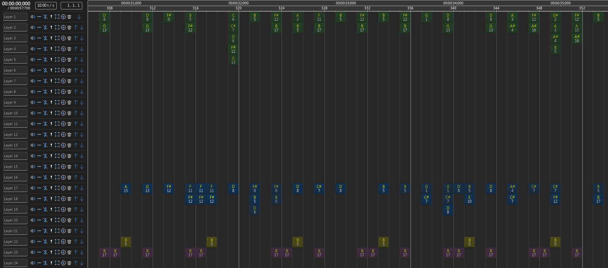
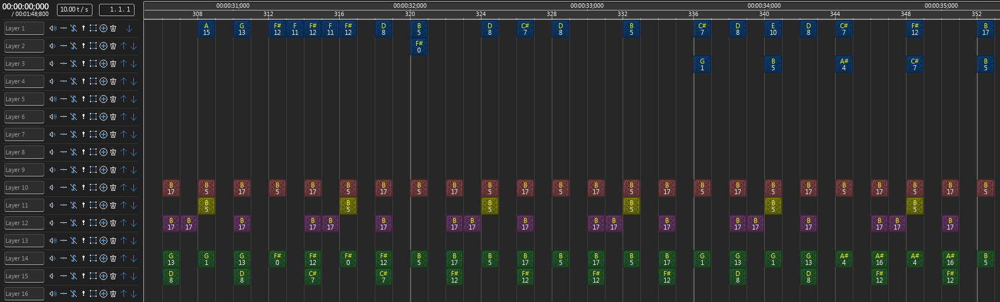

# Általános információk

## Témakiírás

A projekt célja egy olyan parancssori konvertáló program létrehozása, amely hullámos hangfájl formájú (wav/mp3) zenéből képes bizonyos hangmintákat felismerni, és ez alapján létrehozni egy NBS fájlt (a Note Block Studio program saját formátuma). Alapvetően Note Block mintákat tartalmazó hangfájlokban található minták felismerése a cél, különböző időpillanatokban és hangmagasságokban, jó eredménnyel. A probléma nagyban hasonlít a hullámos fájlból MIDI fájl felismerés feladatára, annak egy speciális eseteként is tekinthető.

## Keletkezés körülményei

Ezt a programot a BME mérnökinformatikus képzés Önálló laboratórium tárgyának keretében készítem.

A programot rust nyelven írom (1.75.0-s verziót használok), fájlformátumokhoz és Fourier-transzformációhoz a community könyvtárban található crate-ek közül használok párat, amiket a fordítás előtt a csomagkezelő automatikusan le tud tölteni.

A forráskód MIT licensz alatt elérhető a [Githubon](https://github.com/4321ba/mp3-to-nbs).

# Bevezetés

## Általánosan a wave to midi problémáról

Hullámos hangfájlokban található hangok felismerése gyakori feladat, sokféle megoldás, program létezik már rá. Ilyen programot lehet például használni, ha egy zeneszerző igazi hangszeren szeretné szerezni a zenéjét, ugyanakkor utómunkázni szeretné digitális eszközökkel. Vagy valaki egy már kész zenét le szeretne kottázni, akár azért, hogy le lehessen játszani, vagy azért, hogy lehessen vizualizálni. YouTube-on például elterjedtek ezek az ún. piano tutorial videók, amiket az emberek leginkább nem is azért néznek, hogy megtanulják zongorán lejátszani, hanem azért, mert jól néznek ki. Az egyik úttörő volt ezen a téren a [Synthesia](https://www.synthesiagame.com/) nevű program, ezért az ilyen típusú videókat gyakran nevezik synthesia-nak.

## Ennek a speciális esete, wave to nbs

Ezen projekt egy konkrétabb, speciális esettel foglalkozik, ahol előre ismert hangmintákat keresünk a hangfájlban, amiknek eléggé pontosan lehet tudni a hangmagasságát, a hang hosszát, és a minták is ismertek előre. Emiatt elméletben jóval precízebb felismerés lehetséges, mint korábban. Eddig az adta a legjobb automatizált közelítést, hogyha a hullámos hangfájlból a piacon található egyik MP3 (vagy más hullámos formátum) to MIDI konvertálóval átalakítottuk MIDI-vé a fájlt, majd a Note Block Studio nevű programmal (aminek a formátuma a mi célformátumunk, nbs) importáltuk a MIDI fájlt. Egyik konverzió sem veszteségmentes, de főleg a wave to MIDI rész pontatlan, vagyis lehetne sokkal pontosabb, a minták ismeretében.

## Motiváció

Ez több szempontból előnyös lenne, például a hangok ismeretében lehet [ilyen](https://www.youtube.com/watch?v=L7TTUkqprQ0) vizualizációt csinálni a zenéről, amit a hangok nélkül, csak a hullámos hangfájl ismeretében nem lehetne. Egy másik felhasználási lehetőség, ha valaki át szeretné dolgozni a zenét, újrahangszerelni. Ehhez is kell tudni, hogy milyen hangok szólnak mely időpillanatokban. [Itt](https://www.youtube.com/playlist?list=PLuxIgMW_nasep2O39FE5GZay89wxcGhrL) van például egy lejátszási lista, amik Note Block-os zenéken alapuló feldolgozások.

## Megoldás felvázolása

A felismerés során először meghatározzuk azokat az időpillanatokat, amiket érdemes közelebbről is megvizsgálni, azaz valószínűleg kezd szólni legalább egy minta abban az időpillanatban. Ezt úgy lehet például, hogy hirtelen nő a hangerő, mert minden minta az elején hangos, és aztán elhalkul. Ekkor az összes ismert minta összes hangmagasságát összehasonlítjuk a felismerendő zene azon pártized másodpercével, és meghatározzuk azokat a hangszer-hangmagasság kombinációkat, amiket érdemes tovább vizsgálni, és azokat, amik biztosan nem szólnak. Ezután a potenciális hangokkal egy könyvtári Nelder-Mead optimalizációt futtatunk, ami a különbség abszolútértékének összegét minimalizálja a potenciális hangok, és a cél között. Ekkor kapunk mindegyikre egy-egy hangerőt, ami 0 körül van, ha úgy jött ki a minimumkeresés, hogy ott mégsem szól hang. Ezután ezen hangok lesznek a tippjeink arra az időpillanatra.

## Dokumentum struktúrája

A Bevezetés után felsorolom a kapcsolódó munkákat, ahol kapcsolódó saját projekteket, és más, hasonló célú programokat is bemutatok. Ezután rövid leírást adok a használt adatok formátumáról, és, hogy milyen szokások tartoznak ehhez. A következő címszó alatt található a keresés módszere, a használt minimumkereső algoritmus, a távolság számolása, és az állapottér, amiben keresek. Ezután jön az eredmény felvázolása, hogy milyen hangokat mennyire jól talált meg a program, és mennyire gyorsan. Végül összefoglalom a projektet, és a további fejlesztési lehetőségeket leírom.

# Kapcsolódó munkák

## MeloMIDI

[GitHub link.](https://github.com/4321ba/MeloMIDI) A MeloMIDI egy korábbi projektem, ami hullámos hangfájlból csinál MIDI fájlt. Grafikus felülettel rendelkezik, és a spektrogram fölött lehet egérrel testreszabni az exportálandó MIDI fájlt. Véleményem szerint egészen jó eredményt is képes adni.

## Más wave to midi programok

A teljesség igénye nélkül felsorolok még pár, a MeloMIDI-hez hasonló célú programot:

* [AnthemScore](https://www.lunaverus.com/) MeloMIDI-t inspirálta részben, többet tud, de proprietary. Amilyen kicsit kipróbáltam, jó programnak tűnt.

* [WaoN](https://github.com/kichiki/WaoN) Nagyon régi, elég halott projekt, kicsit használtam. Néhol internetes "wave to midi" konvertálók ezt használják, bár nem mindig vallják be / teszik könnyen kitalálhatóvá. Komplexebb fájlokból nem túl használható a kimenet, de jó kis projekt azért, illetve free / open source.

* [ISSE](https://sourceforge.net/projects/isse/) Hangforrások szeparálására tervezett program, rajzolni lehet a spektrogramon, hogy melyik rész melyik hangforráshoz tartozik, és ez alapján hoz létre két külön hullámos fájlt, a két forrással. Ez is free / open source, és ez sem volt régóta frissítve.

* [Melodyne](https://www.celemony.com/en/melodyne/what-is-melodyne) Sose használtam, de jól néz ki. És drága.

## Noteblock Music Yoinker

[GitHub link.](https://github.com/4321ba/noteblock_music_yoinker) Ez egy saját projekt, ami egy Minecraft modból, és python scriptekből áll, note block-os zenék felvételére, egy saját, csv alapú formátumba. A mod elég fapados, a játékon belül hallott zenét önti egy csv fájlba. Ezután ezt python scriptekkel lehet sokféleképpen feldolgozni: összefűzni / átlagolni több felvételt ugyanarról a zenéről, hogy eltüntesse / csökkentse a hálózat okozta lagot / pontatlanságot. Ezt lehet konvertálni MIDI fájllá, és NBS fájllá is, illetve NBS fájlt is lehet konvertálni ebbe a csv formátumba, ami könnyebb összehasonlítást tesz lehetővé. Ez a jövőben hasznos lehet ennél a projektnél is, az eredeti és a felismert fájl összehasonlítására.

Ezzel a programmal a Wynncraft nevű Minecraft szerver zenéjének jó részét "felvettem", és ez is [elérhető](https://github.com/4321ba/Wynncraft_Noteblock_OST). Ez jogi kérdéseket is felvet, bár én amellett szeretnék érvelni, hogy jogilag ne legyen különböző az, hogy egy zene milyen formátumban érhető el (mp3, midi vagy nbs pl.). A YouTube-on ezek a zenék Creative Commons Attribution license (reuse allowed) licensszel [érhetőek el](https://www.youtube.com/playlist?list=PLyqkjDCr8kbI3CjNZimiri8shU1GbfJ6E), hivatalos forrásból. Ez az adathalmaz a későbbiekben pontosság tesztelésére hasznos lehet, bár ők csak 5 hangszert használnak, viszont hangerőt is.

## Galaxy Jukebox

[GitHub link.](https://github.com/4321ba/Galaxy_Jukebox) Ez is saját projekt, NBS fájlból képes olyan Minecraft-beli redstone áramkört létrehozni, ami az adott zenét lejátssza, a játékon belül.

## Synthesijava

[GitHub link.](https://github.com/4321ba/synthesijava) Programozás alapjai 3 házi feladatom, a fentebb említett Synthesia másolata, MIDI fájlok vizualizációjára.

## Open Note Block Studio

[GitHub link.](https://github.com/OpenNBS/OpenNoteBlockStudio) A célformátum (nbs) szerkesztője, Minecraft Note Block-os zenéket lehet vele szerkeszteni, létrehozni, megtekinteni, exportálni hullámos hanggá, és Minecraftban lejátszható redstone áramkörré is (bár ez a része több szempontból átdolgozásra szorul).

## Nbswave

[GitHub link.](https://github.com/Bentroen/nbswave) Az ONBS új hullámos exportere, mert a régi elég pontatlan, és a túlvezérlés sem megoldott.

# Adatok formátuma

## Bemenő adat

A hullámos hangfájlok ismertek, például mp3, wav, ogg. Kicsomagolást a [babycat](https://crates.io/crates/babycat) könyvtár elvégzi, mi megkapjuk a mintákat, másodpercenként `frame_rate_hz`-nyit, például 44100-at. Kérdés, hogy mi történjen többcsatornás hangfájlokkal, egyelőre mono-vá konvertáljuk importáláskor. Ritka, de előfordul az olyan noteblock-os zene, ahol van sztereó információ is, ezeket a jövőben fel lehetne használni, hogy a jobb és bal csatornán külön elvégzett felismerés alapján az nbs fájlban a hangok panning értékét is beállítsuk (azaz, hogy mennyire jobbról/balról szól az adott hang).

## Kimenő adat

16 féle hangszer van, de korábbi Minecraft verzióban sokáig csak 5-6 volt, ezért is van az, hogy a fentebb említett Wynncraft szerver zenéi csak 5-féle hangszerrel vannak megírva. A program jelenleg 4 hangszer felismerésével van tesztelve, és így biztosan jól működik, a jövőben könnyen bővíthető a többi hangszerrel, bár tesztelés, és az optimalizálás finomhangolása valószínűleg szükséges, és megoldandó kérdés, hogy az ugyanolyan magasságon levő különböző hangszereket mennyire tudja a rendszer megkülönböztetni.

Hangmagasságból a játékon belül 25 elérhető (2 oktáv, [kiegyenlített hangolással](https://en.wikipedia.org/wiki/12_equal_temperament)). A szerkesztőprogram megengedi ezen kívüli hangok felvételét is, viszont pirossal jelzi az inkompatibilitást. A saját programunkban ezt úgy lehetne a jövőben lekövetni, hogy parancssori opcióként a felhasználó képes legyen a 2 oktávon kívüli hangok felismerésére is, viszont alapértelmezetten csak 2 oktávval próbálkozzon a program. Jelenleg nincs választási lehetősége a felhasználónak, a játékbeli 2 oktávot próbálja a program felismerni.

Hangerő: 0.0 és 1.0 között reprezentáljuk, a szerkesztőprogram 0% és 100% között. Problémás a felismerése, amennyiben a túlvezérlés elkerülése érdekében az nbs to mp3 exportáló, vagy csak simán a Studio maga, lejjebb veszi a hangerőt. Akkor minden más felismerés is problémás, ha nem veszi lejjebb a hangerőt, és ezért sok helyen túlvezérlés van. 1.0 fölé is mehet a hangerő, ha egyszerre ugyanaz a hangszer ugyanazon a hangerőn többször is szól, ez elég gyakori a Wynncraftos adathalmazban, és a MIDI fájl konverziónál problémákat okoz (mert az viszont MIDI fájlnál nem túl támogatott), ezt jobban oldanám meg, ha újracsinálnám. Mindenesetre ez a program arra, hogy ugyanaz a hangszer+hangmagasság+időpillanat többször is szól, nincs felkészítve. Jelenleg csak egy hang lesz, 100%-on maximalizálva. Jelenleg találhatóak fontosabb problémák is még.

Időzítés: a tempót tps-ben mérjük, ami tick per second. Ez lényegében bpm, csak nem per perc, hanem per másodperc, és nem a negyedeket (=tá-kat) számoljuk, hanem inkább a 16-odokat (=riri-ket), de legalábbis a zenében található legkisebb időbeli különbséget két szóló hang között (=tick). A szokásos értéke 5, 10 és 20, előfordul még 6.75 is, 6.67 helyett. Mert régebben .25-ökre kerekítette a Studio, ma már bármi előfordulhat, bár gyakorlatban szerintem még mindig a .25-ös kerekítést használják leginkább, és az elég pontos is. A játékban a fentebbi 4 játszható le tökéletesen, de a Studioban bármilyen tempóval lehet írni zenét. A tempó a zene során állandó, azt nem lehet megváltoztatni, viszont felvételben található lag, pontatlanság (illetve az exporter bénasága) miatt nem szeretném elvárni, hogy tényleg pontosan a megadott időpillanatban fog a hangok megszólalása történni. Ezt azért is jobb érzékelni dinamikusan, mert könnyű egy 2 perces zenénél a végére elcsúszni egy tizedmásodpercet, és azzal már elromlik a felismerés. Persze a felismert időpillanatokat utána kvantálni kell, és ráilleszteni egy adott tps-re, amit jelenleg meg kell adni a programnak, de a jövőben jó lenne jó pontossággal felismerni. Kezdetleges felismerés már elérhető, de sokat ront az eredményen, ha rosszul történik a felismerés, ugyanakkor kézzel könnyű megadni (amennyiben tudja az ember az adott zenéről), ezért jelenleg jobb kézzel megadni, hardcode-olni.

A kimenő fájlformátum a Note Block Studio saját fájlformátuma, az nbs, [itt](https://opennbs.org/nbs) található a dokumentációja, de mi egy könyvtárat használunk az exportálásra. Leegyszerűsítve egy 2D Note Block-ok tömbjét kell kiadnunk. vízszintes tengelyen az idő van, egy-egy oszlopot tick-nek nevezünk. Egy-egy sor neve a layer, és általában egy hangszert szoktak csak rá tenni. Ezt megcsináltam én is az exporternél, hogy szebben nézzen ki a fájl: a következő hangszer csak ott kezdődik, hogyha az összes tick-ben szabad lesz az a sor. A mellékelt ábrán a Note Block Studio látható, ő különböző színekkel jelzi a különböző hangszereket.

# Keresés módszere

## Előfelismerés

A könyvtári optimalizáló algoritmus állapotterének minimalizálása érdekében előzetesen megpróbáljuk felismerni azokat a hangszer-hangmagasság kombinációkat, ahol elképzelhető hang, és azokat, ahol nem. Ez úgy történik, hogy a hangminta spektrogramját kivonjuk a felismerendő zenerészlet spektrogramjából (elemenként), majd egy ReLU-szerű (f(x)=max(0,x)) függvényt engedünk rá, pixelenként (azaz minden adott időpillanat-frekvencia párosra). Majd a "hibákat" (vagy a négyzetüket) összeadjuk, és ez alapján egy threshold-dal döntjük el, hogy elfogadjuk-e az adott hang létezésének lehetőségét. Ez a ReLU azért kell, hogy azt ne büntessük, ha sok hang van a zenerészletben, azt viszont büntessük, ha pont az a frekvencia, aminek ott kéne lennie, az nincs ott.

## Optimalizálás

Miután meghatároztuk azt a pár hangszer-hangmagasság párost, amik potenciálisan szólnak az adott tick-ben, egy könyvtári optimalizáló algoritmussal meghatározzuk a hiba minimumához tartozó állapotot, ahol a hiba a két spektrogram különbségének abszolútértékeinek összege (~MAE), az állapot pedig a hangerő hangonként, leginkább 0 és 1 között.

Optimalizáló algoritmusok között a Particle Swarm Optimization-t, és a Nelder-Mead módszert próbáltam, amik közül az utóbbi tűnt jobbnak, ezt lentebb kifejtem. Azért ezek kerültek szóba, mert komplex számítás eredménye a hiba, ami nem deriválható, vagy legalábbis nagyon bonyolult. A Nelder-Mead módszer lényege: n dimenzió esetén n+1 db "csúcspont"-tal meghatároz egy n-dimenziós tetraédert, majd lépésenként a csúcspontokat transzformálja: egyet odébbtol (növelve, csökketve, vagy vetítve), vagy közelebb viszi a csúcspontokat egymáshoz, stb., attól függően, hogy az adott pontokban milyen hibát kap az általunk megadott függvénytől.

# Eredmények

## Általános értékelés

A program eléggé sikeresen fel tud ismerni egy, az nbswave-vel exportált zenét, amiben lehetnek harp, bass, snare és click hangszerek. Meg kell viszont adni perpillanat a túlvezérlés elleni kompenzáció mértékét, illetve a tps-t, hogy jó legyen a felismerés, ezeket később jó lenne alapértelmezetten felismerni. A felismerés további javítása, és a program tesztelése több zenével, illetve később többféle hangszerrel, szükséges. Továbbá szükséges egyéb exporterekkel, felvételi módszerekkel szerzett hangfájlokon történő tesztelés: túlvezérlés, apró hangmagasság-eltolódás, illetve időzítés-beli pontatlanság ellen jobban védjen. A program képes kihasználni a többszálúságot, és fordítási idejű optimalizáció kihasználásával elfogadható időn belül lefut, bár lenne értelme a további futásidő-optimalizációnak. A 8-9 éves intel laptopomon jelenleg körülbelül 2 perc alatt ismeri fel az 1 perces zenét.

Eredeti:

Felismert (ugyanaz a kép, mint fentebb):

## Optimalizálási algoritmusok összehasonlítása

TODO 2d grafikon: függvényhívások száma X hiba

# Összefoglalás

Összességében sikeresen analizáltuk a hullámos fájlt, találtunk adott időpillanatokban erős tippeket a szóló hangokra. Megismerkedtünk az nbs formátummal, és a Note Block-os zenék speciális tulajdonságaival.

A továbbiakban a teljesség igénye nélkül az alábbi fejlesztési lehetőségek végrehajtása lenne előnyös:

- több hangszer felismerése
- tesztelés több zenével
- felismerés pontosítása, például előző tickben felismert hangok hullámának hozzáadásával a mostani felismerés közben
- Nelder-Mead optimalizációnak értelmesebb kezdeti érték adása az előfelismerés eredménye alapján
- automata tps, és túlvezérlés-kompenzáció felismerés
- parancssori kapcsolók a gyakran változtatandó paraméterekre
- robusztusabb felismerés másfajta nbs to wave exporterek / módszerek által generált hangfájlokra
- tesztelés más resource pack-kel / soundfonttal
- futásidő optimalizálása
- felismerés pontosságának mérése nagyobb adathalmazon, miután már kellően jó a felismerés
- sztereó felismerés, egyszerre ugyanaz a hang többször
- megpróbálni a layereket felismerni, amiken általában ugyanolyan hangerővel szerepelnek a hangok, ezen hangerők kerekítése a felismert hangerőre, és layer volume-ok használata

