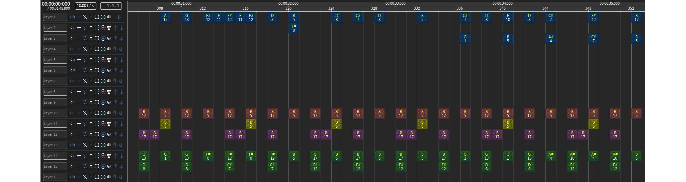
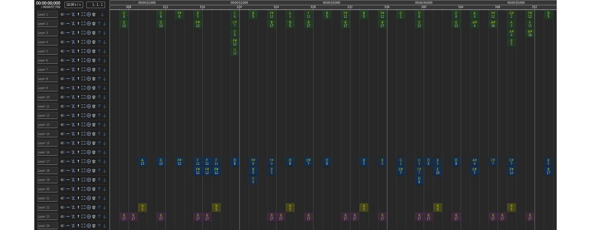

# Általános információk

## Témakiírás

A projekt célja egy olyan parancssori konvertáló program létrehozása, amely hullámos hangfájl formájú (wav/mp3) zenéből képes bizonyos hangmintákat felismerni, és ez alapján létrehozni egy NBS fájlt (a Note Block Studio program saját formátuma). Alapvetően Note Block mintákat tartalmazó hangfájlokban található minták felismerése a cél, különböző időpillanatokban és hangmagasságokban, jó eredménnyel. A probléma nagyban hasonlít a hullámos fájlból MIDI fájl felismerés feladatára, annak egy speciális eseteként is tekinthető.

## Keletkezés körülményei

Ezt a programot a BME mérnökinformatikus képzés Önálló laboratórium tárgyának keretében készítem.

A programot rust nyelven írom (1.75.0-s verziót használok), fájlformátumokhoz és Fourier-transzformációhoz a community könyvtárban található crate-ek közül használok párat, amiket a fordítás előtt a csomagkezelő automatikusan le tud tölteni.

A forráskód MIT licensz alatt elérhető a [Githubon](https://github.com/4321ba/mp3-to-nbs).

# Bevezetés

## Általánosan a wave to midi problémáról

Hullámos hangfájlokban található hangok felismerése gyakori feladat, sokféle megoldás, program létezik már rá. Ilyen programot lehet például használni, ha egy zeneszerző igazi hangszeren szeretné szerezni a zenéjét, ugyanakkor utómunkázni szeretné digitális eszközökkel. Vagy valaki egy már kész zenét le szeretne kottázni, akár azért, hogy le lehessen játszani, vagy azért, hogy lehessen vizualizálni. YouTube-on például elterjedtek ezek az ún. piano tutorial videók, amiket az emberek leginkább nem is azért néznek, hogy megtanulják zongorán lejátszani, hanem azért, mert jól néznek ki. Az egyik úttörő volt ezen a téren a [Synthesia](https://www.synthesiagame.com/) nevű program, ezért az ilyen típusú videókat gyakran nevezik synthesia-nak.

## Ennek a speciális esete, wave to nbs

Ezen projekt egy konkrétabb, speciális esettel foglalkozik, ahol előre ismert hangmintákat keresünk a hangfájlban, amiknek eléggé pontosan lehet tudni a hangmagasságát, a hang hosszát, és a minták is ismertek előre. Emiatt elméletben jóval precízebb felismerés lehetséges, mint korábban. Eddig az adta a legjobb automatizált közelítést, hogyha a hullámos hangfájlból a piacon található egyik MP3 (vagy más hullámos formátum) to MIDI konvertálóval átalakítottuk MIDI-vé a fájlt, majd a Note Block Studio nevű programmal (aminek a formátuma a mi célformátumunk, nbs) importáltuk a MIDI fájlt. Egyik konverzió sem veszteségmentes, de főleg a wave to MIDI rész pontatlan, vagyis lehetne sokkal pontosabb, a minták ismeretében.

## Motiváció

Ez több szempontból előnyös lenne, például a hangok ismeretében lehet [ilyen](https://www.youtube.com/watch?v=L7TTUkqprQ0) vizualizációt csinálni a zenéről, amit a hangok nélkül, csak a hullámos hangfájl ismeretében nem lehetne. Egy másik felhasználási lehetőség, ha valaki át szeretné dolgozni a zenét, újrahangszerelni. Ehhez is kell tudni, hogy milyen hangok szólnak mely időpillanatokban. [Itt](https://www.youtube.com/playlist?list=PLuxIgMW_nasep2O39FE5GZay89wxcGhrL) van például egy lejátszási lista, amik Note Block-os zenéken alapuló feldolgozások.

## Megoldás felvázolása

A felismerés során először meghatározzuk azokat az időpillanatokat, amiket érdemes közelebbről is megvizsgálni, azaz valószínűleg kezd szólni legalább egy minta abban az időpillanatban. Ezt úgy lehet például, hogy hirtelen nő a hangerő, mert minden minta az elején hangos, és aztán elhalkul. Ekkor az összes ismert minta összes hangmagasságát összehasonlítjuk a felismerendő zene azon pártized másodpercével, és meghatározzuk azokat a hangszer-hangmagasság kombinációkat, amiket érdemes tovább vizsgálni, és azokat, amik biztosan nem szólnak. Ezután a potenciális hangokkal egy könyvtári Nelder-Mead optimalizációt futtatunk, ami a különbség abszolútértékének összegét minimalizálja a potenciális hangok, és a cél között. Ekkor kapunk mindegyikre egy-egy hangerőt, ami 0 körül van, ha úgy jött ki a minimumkeresés, hogy ott mégsem szól hang. Ezután ezen hangok lesznek a tippjeink arra az időpillanatra.

# Kapcsolódó munkák

## Open Note Block Studio

[GitHub link.](https://github.com/OpenNBS/OpenNoteBlockStudio) A célformátum (nbs) szerkesztője, Minecraft Note Block-os zenéket lehet vele szerkeszteni, létrehozni, megtekinteni, exportálni hullámos hanggá, és Minecraftban lejátszható redstone áramkörré is (bár ez a része több szempontból átdolgozásra szorul).

## Nbswave

[GitHub link.](https://github.com/Bentroen/nbswave) Az ONBS új hullámos exportere, mert a régi elég pontatlan, és a túlvezérlés sem megoldott.

# Keresés módszere

## Előfelismerés

A könyvtári optimalizáló algoritmus állapotterének minimalizálása érdekében előzetesen megpróbáljuk felismerni azokat a hangszer-hangmagasság kombinációkat, ahol elképzelhető hang, és azokat, ahol nem. Ez úgy történik, hogy a hangminta spektrogramját kivonjuk a felismerendő zenerészlet spektrogramjából (elemenként), majd egy ReLU-szerű (f(x)=max(0,x)) függvényt engedünk rá, pixelenként (azaz minden adott időpillanat-frekvencia párosra). Majd a "hibákat" (vagy a négyzetüket) összeadjuk, és ez alapján egy threshold-dal döntjük el, hogy elfogadjuk-e az adott hang létezésének lehetőségét. Ez a ReLU azért kell, hogy azt ne büntessük, ha sok hang van a zenerészletben, azt viszont büntessük, ha pont az a frekvencia, aminek ott kéne lennie, az nincs ott.

## Optimalizálás

Miután meghatároztuk azt a pár hangszer-hangmagasság párost, amik potenciálisan szólnak az adott tick-ben, egy könyvtári optimalizáló algoritmussal meghatározzuk a hiba minimumához tartozó állapotot, ahol a hiba a két spektrogram különbségének abszolútértékeinek összege (~MAE), az állapot pedig a hangerő hangonként, leginkább 0 és 1 között.

Optimalizáló algoritmusok között a Particle Swarm Optimization-t, és a Nelder-Mead módszert próbáltam, amik közül az utóbbi tűnt jobbnak, ezt lentebb kifejtem. Azért ezek kerültek szóba, mert komplex számítás eredménye a hiba, ami nem deriválható, vagy legalábbis nagyon bonyolult. A Nelder-Mead módszer lényege: n dimenzió esetén n+1 db "csúcspont"-tal meghatároz egy n-dimenziós tetraédert, majd lépésenként a csúcspontokat transzformálja: egyet odébbtol (növelve, csökketve, vagy vetítve), vagy közelebb viszi a csúcspontokat egymáshoz, stb., attól függően, hogy az adott pontokban milyen hibát kap az általunk megadott függvénytől.

# Eredmények

## Általános értékelés

A program eléggé sikeresen fel tud ismerni egy, az nbswave-vel exportált zenét, amiben lehetnek harp, bass, snare és click hangszerek. Meg kell viszont adni perpillanat a túlvezérlés elleni kompenzáció mértékét, illetve a tps-t, hogy jó legyen a felismerés, ezeket később jó lenne alapértelmezetten felismerni. A felismerés további javítása, és a program tesztelése több zenével, illetve később többféle hangszerrel, szükséges. Továbbá szükséges egyéb exporterekkel, felvételi módszerekkel szerzett hangfájlokon történő tesztelés: túlvezérlés, apró hangmagasság-eltolódás, illetve időzítés-beli pontatlanság ellen jobban védjen. A program képes kihasználni a többszálúságot, és fordítási idejű optimalizáció kihasználásával elfogadható időn belül lefut, bár lenne értelme a további futásidő-optimalizációnak. A 8-9 éves intel laptopomon jelenleg körülbelül 2 perc alatt ismeri fel az 1 perces zenét.

Eredeti:

Felismert:

## Optimalizálási algoritmusok összehasonlítása

Az alábbi ábra a két kipróbált módszert (Nelder-Mead Method, és Particle Swarm Optimization) hasonlítja össze költségfüggvényhívások száma, és elért hiba alapján.

Természetesen mindkét módszer használatát lehetne tovább optimalizálni, jobb kezdeti értékekkel, PSO-nál jobb swarm-mérettel, a paraméterek finomhangolásával. De alapvetően a Nelder-Mead jóval gyorsabban, és jobb eredményt adott. Sőt, a PSO-t ezekkel a paraméterekkel hiába futtatom tovább, nem tud a grafikonon is szereplő hibánál jobb eredményt adni.

Mindkét módszernél 200 iterációt futtattam, bár ez a két módszernél más-mást jelent. A NM a 311 függvényhívásával 1,607s alatt végzett (=193,5 hívás/s) és 0,02367-es minimum cost-ot ért el, míg a PSO a 8040db függvényhívásával 39,295s alatt (=204,6 hívás/s) 0,2434-es minimum costot ért el. Tehát ráadásul a hívások között a Nelder-Mead többet gondolkodott, ami ennél a problémánál előnyös, mivel elég drága a costfüggvény hívása.

A megtalált értékek a következőképpen alakultak:

| Megoldás | Nincs    | Van    | Nincs   | Nincs    | Van    | Nincs    | Nincs   | Van    | Van    | Van    | Van    |
| -------- | -------- | ------ | ------- | -------- | ------ | -------- | ------- | ------ | ------ | ------ | ------ |
| NM       | 0.007655 | 0.7186 | -0.0072 | -0.00057 | 0.7188 | 0.001538 | -0.0012 | 0.7197 | 0.7247 | 0.7165 | 0.7175 |
| PSO      | 0.0      | 0.7189 | 0.0     | 0.0      | 0.7188 | 0.0      | 0.0     | 0.7184 | 1.0    | 0.7165 | 0.7195 |

# Összefoglalás

Összességében sikeresen analizáltuk a hullámos fájlt, találtunk adott időpillanatokban erős tippeket a szóló hangokra. Megismerkedtünk az nbs formátummal, és a Note Block-os zenék speciális tulajdonságaival.

A továbbiakban különböző fejlesztések végrehajtása lenne előnyös.
